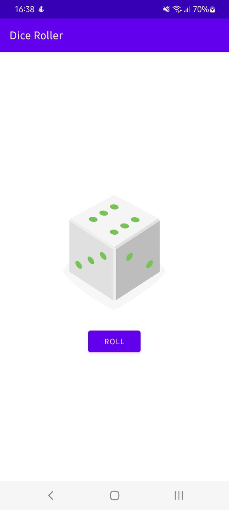

# Android-programs
Написанные на Kotlin программы под андроид
Для запуска необходимо скачать .apk файл в папке игры находящийся по пути ProjectName\app\build\outputs\apk\apk-debug.apk на андроид и установить приложение
#1.DiceRoller

